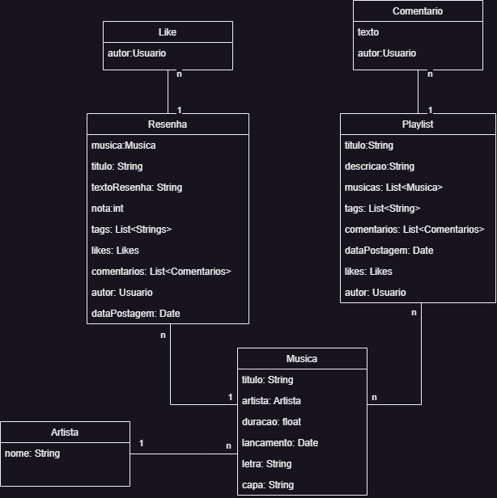

# :checkered_flag: SongBox

Um site focado na compartilhamento de opiniões sobre músicas, permitindo que usuários criem resenhas para músicas, criem suas próprias playlists, e interajam entre si por meio de comentários e avaliações.
## :technologist: Membros da equipe

508578 - Victor Martins Vieira - Engenharia de software

## :people_holding_hands: Papéis ou tipos de usuário da aplicação

- **Autor**: Pode criar suas reviews, visualizá-las, editá-las e as remover
- **Admin**: Pode adicionar, atualizar e remover músicas do catálogo do site.
- **Usuário não logado**: Pode visualizar as músicas do site.

## :spiral_calendar: Entidades ou tabelas do sistema

  

## :triangular_flag_on_post:	 Principais funcionalidades da aplicação

- Avaliar uma música: Um usuário comum poderá fazer uma resenha para uma música individual - O usuário precisará estar logado para criar, editar ou deletar uma resenha
- Visualizar estatíticas internas sobre músicas, como média das notas, quantidade de avaliações, dentre outros - Todos os usuários poderão acessar essa funcionalidade
- Admins poderão adicionar, remover e atualizar o catálogo de músicas do site.
----

## :desktop_computer: Tecnologias e frameworks utilizados

**Frontend:**

- Vue3: 
- Pinia
- Vue Router
- Axios
- Typescript
- Bootstrap 5

**Backend:**

- Strapi

## :shipit: Operações implementadas para cada entidade da aplicação

| Entidade| Criação | Leitura | Atualização | Remoção |
| --- | --- | --- | --- | --- |
| Música | X |  X  | X | X |
| Review | X | X |  X | X |
| Tag | X | X |  |  |
| Artista |   | X |  |  |

## :neckbeard: Rotas da API REST utilizadas

| Método HTTP | URL |
| --- | --- |
| POST | api/auth/local |
| GET | api/artists |
| GET | api/musics |
| GET | api/musics/{id} |
| POST | api/musics |
| DELETE | api/musics/{id} |
| PUT | api/musics/{id} |
| GET | api/reviews?filters[author][id][$eq]={id} |
| GET | api/reviews?filters[music][id][$eq]={id} |
| POST | api/reviews |
| PUT | api/reviews/{id} |
| DELETE | api/reviews/{id} |
| POST | api/tags |
| GET | api/tags?filters[tag][$eq]={tagName} |
